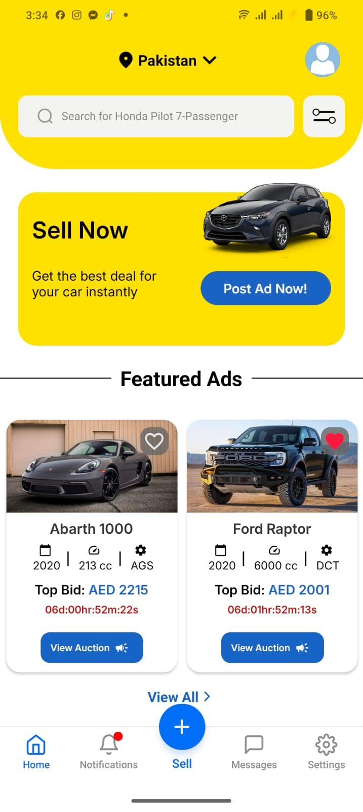
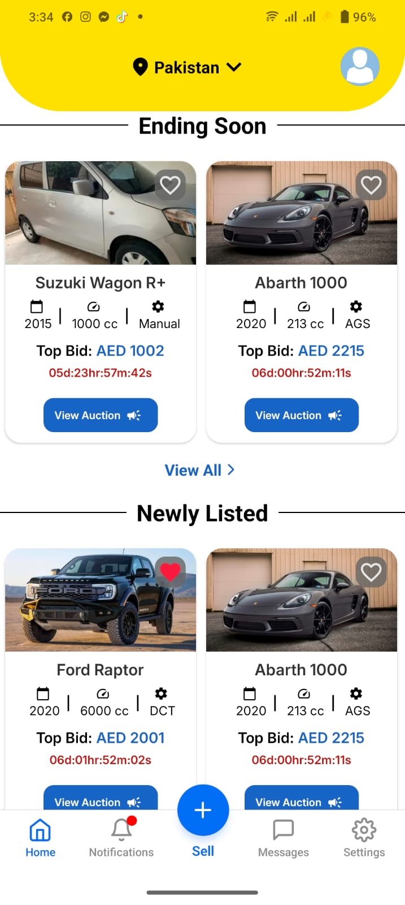
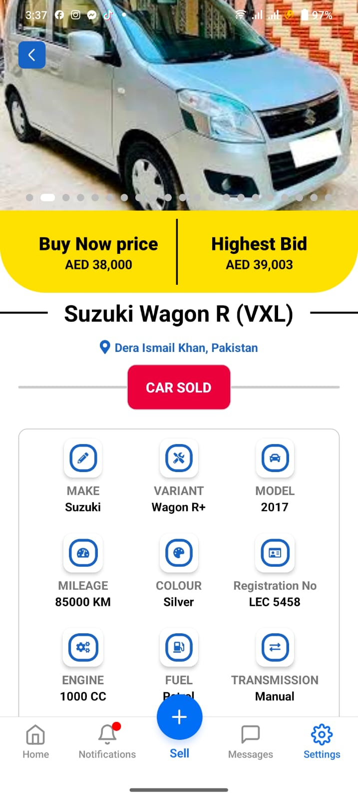
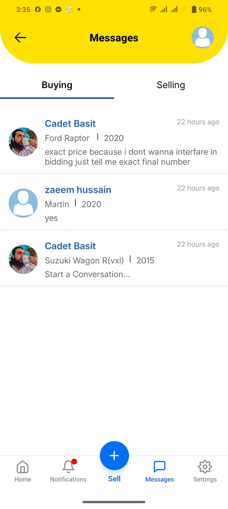
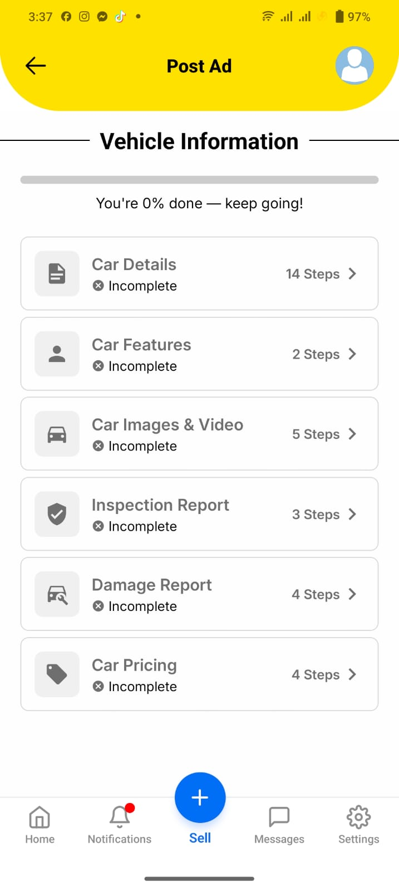
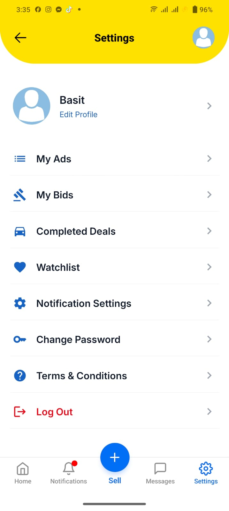

# 🚗 DriveBids Mobile App

A modern React Native app for seamless vehicle listing, bidding, and user interaction.

---

## 📱 App Screenshots

  
  
  

  
  
  

---

## 🔧 Features

- User Authentication
- Vehicle Listings and Search
- Real-time Bidding
- Admin and User Profiles
- Push Notifications

## 🛠 Tech Stack

- React Native (Expo)
- Redux / Context API
- Firebase
- Node.js Backend
